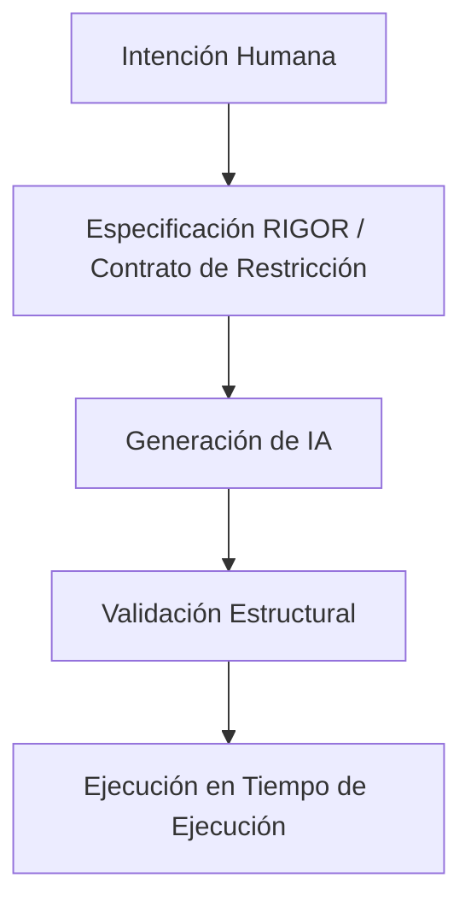

# Modelo del Protocolo (v0.1)

## 1. Propósito

El Modelo del Protocolo de Restricción de IA de RIGOR define el marco conceptual formal que gobierna los límites estructurales de los sistemas generados por IA. Formaliza:
- La posición estructural del protocolo.
- Sus componentes normativos.
- Los límites de interacción entre intención humana, generación de IA y ejecución en tiempo de ejecución.

## 2. Posición Arquitectónica

En el desarrollo moderno asistido por IA, RIGOR introduce una **Capa de Restricción** que opera entre la intención humana y la ejecución en tiempo de ejecución:

El protocolo no genera implementación ni ejecuta procesos; define y hace cumplir límites estructurales a través de **validación previa a la ejecución**.

## 3. Componentes Normativos Centrales

El protocolo RIGOR se compone de cinco componentes obligatorios:

### 3.1 Dominio de Intención
Define el espacio estructural formalmente permitido. Incluye estados válidos, eventos permitidos, transiciones explícitas y límites de versión. Cualquier cosa fuera de este dominio es estructuralmente inválida.

### 3.2 Contrato de Restricción
Una instancia de especificación verificable por máquina (la Spec). Describe definiciones de estado, mapeos de transiciones, reglas de clasificación de versión y restricciones de migración. Una vez validada para una versión dada, el contrato es inmutable.

### 3.3 Límite de Generación
Define la interfaz entre la salida de IA y la validación estructural. La generación de IA solo se permite dentro de límites declarados. No se permiten transiciones implícitas o elementos estructurales no declarados.

### 3.4 Motor de Validación (Rol Conceptual)
El motor evalúa el cumplimiento estructural y confirma transiciones determinísticas. No ejecuta lógica de negocio; su único propósito es hacer cumplir la legalidad estructural. La ejecución sin validación previa viola el protocolo.

### 3.5 Capa de Evolución
Define cómo se clasifican los cambios estructurales. Cada cambio debe categorizarse explícitamente como **Compatible**, **Condicional** o **Rompedor**. La evolución estructural silenciosa está prohibida.

### 3.6 Esquema de Contexto y Sistema de Tipos
Cada proceso RIGOR DEBE declarar un `context_schema` tipado. El contexto representa los datos de estado persistentes propiedad de la instancia del proceso.

**Requisitos:**
* Todos los campos deben declararse explícitamente con un tipo estático.
* No se permiten propiedades implícitas.
* Las mutaciones de contexto deben ajustarse a los tipos declarados.
* Los campos desconocidos se rechazan en el momento de la validación.

Sin un esquema de contexto declarado, un proceso no es válido. Esto permite la validación estática, la legalidad de la mutación determinista y la compatibilidad entre motores.

## 4. Modelo de Mutación Dirigido por Eventos

RIGOR impone una arquitectura de mutación dirigida por eventos. El estado y el contexto solo pueden cambiar dentro de transiciones declaradas explícitamente activadas por eventos.

Una transición válida debe:
1. Declarar el evento activador.
2. Declarar el estado de destino.
3. Declarar explícitamente qué campos del contexto mutan.

El protocolo prohíbe las mutaciones fuera de las transiciones. Esta restricción garantiza la trazabilidad estructural, la evolución predecible del estado y la eliminación de efectos secundarios ocultos.

## 5. Invariantes Extendidos del Protocolo

Las siguientes propiedades son obligatorias para cualquier sistema compatible con RIGOR:

1. **Invariante de Tipado Explícito**: Todos los datos del contexto deben estar declarados en el esquema. No se permiten propiedades dinámicas.
2. **Invariante de Localidad de Mutación**: La mutación del contexto solo puede ocurrir dentro de transiciones declaradas activadas por eventos.
3. **Invariante de Atomicidad de Eventos**: Cada evento se procesa como una unidad transaccional independiente (Todo o Nada).
4. **Transición Determinística**: Dado un Estado + Evento, la transición resultante está definida de forma única.
5. **Invariante de Reproducción Determinista**: Dado el mismo estado inicial y una secuencia de eventos ordenada, el resultado debe ser idéntico.
6. **Precedencia de Validación**: La validación estructural siempre debe preceder a la ejecución.
7. **Invariante de Ausencia de Efectos Secundarios Implícitos**: El protocolo no permite mutaciones de estado ocultas o no declaradas.
8. **Invariante de Estabilidad Terminal**: Los estados terminales no pueden emitir más transiciones.

## 6. Semántica de Eventos Transaccionales

Cada evento procesado constituye una única unidad transaccional atómica. El manejo de eventos debe ejecutar los siguientes pasos:
1. Validar que el evento es aplicable en el estado actual.
2. Evaluar guards opcionales (que deben ser puros).
3. Aplicar mutaciones de contexto declaradas.
4. Transicionar al nuevo estado.
5. Persistir el nuevo estado y el contexto de forma atómica.

Si falla algún paso, no se persiste ninguna mutación y el proceso permanece en su estado anterior. Esto garantiza una consistencia fuerte a nivel de proceso.

## 7. Emisión y Cola de Eventos Internos

RIGOR permite la emisión de eventos internos. Sin embargo:
* Los eventos emitidos DEBEN ponerse en cola.
* NO DEBEN procesarse dentro del mismo límite transaccional.
* DEBEN procesarse como eventos posteriores independientes.

Esto preserva la semántica de eventos atómicos y el comportamiento de reproducción determinista.

## 8. Flujo de Validación Estructural

El protocolo requiere un ciclo de vida de validación en dos pasos:

1. **Validación Pre-generación**: Verificación de la Especificación (Contrato de Restricción) en sí misma.
2. **Validación Estructural Post-generación**: Verificación de que el código/implementación generada se adhiere estrictamente a la especificación validada.

El fallo en cualquier etapa invalida el proceso.

## 9. Delimitación Estructural

RIGOR introduce la propiedad de **Delimitación Estructural**: un sistema no puede evolucionar más allá de su dominio estructural declarado sin una ruptura de versión explícita. Esto asegura evolución trazable, migración predecible y compatibilidad determinística.

## 10. Modelo de Consistencia

RIGOR garantiza una **consistencia fuerte** a nivel de proceso. No requiere transacciones distribuidas globales. En su lugar, la consistencia se logra mediante el procesamiento atómico por evento, la lógica de transición determinista y los contratos de eventos explícitos. Los sistemas externos deben integrarse a través de límites de eventos.

## 11. Estabilidad y Evolución del Núcleo

RIGOR Core v0.1 se considera semánticamente congelado. Los cambios deben clasificarse explícitamente como:
* **Compatible** (aditivo)
* **Condicionalmente Compatible**
* **Rompedor** (Breaking - requiere un incremento de versión mayor)

Esta política protege la estabilidad del ecosistema y garantiza que los cambios rompedores sean intencionales y manejables.

## 12. Separación de Responsabilidades

El protocolo enforceza separación formal entre cuatro capas distintas:
1. **Definición de Lenguaje** (El DSL de RIGOR).
2. **Instancia de Especificación** (El Contrato de Restricción específico).
3. **Mecanismo de Validación** (La lógica de validación del Motor).
4. **Tiempo de Ejecución** (La implementación real del sistema).

Ninguna capa puede asumir implícitamente el comportamiento estructural de otra; todo acoplamiento debe ser explícito y declarado.
