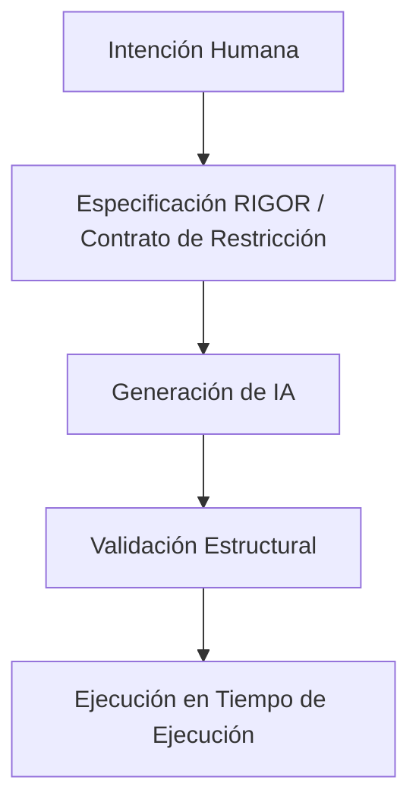

# Modelo del Protocolo (v0.1)

## 1. Propósito

El Modelo del Protocolo de Restricción de IA de RIGOR define el marco conceptual formal que gobierna los límites estructurales de los sistemas generados por IA. Formaliza:
- La posición estructural del protocolo.
- Sus componentes normativos.
- Los límites de interacción entre intención humana, generación de IA y ejecución en tiempo de ejecución.

## 2. Posición Arquitectónica

En el desarrollo moderno asistido por IA, RIGOR introduce una **Capa de Restricción** que opera entre la intención humana y la ejecución en tiempo de ejecución:

El protocolo no genera implementación ni ejecuta procesos; define y hace cumplir límites estructurales a través de **validación previa a la ejecución**.

## 3. Componentes Normativos Centrales

El protocolo RIGOR se compone de cinco componentes obligatorios:

### 3.1 Dominio de Intención
Define el espacio estructural formalmente permitido. Incluye estados válidos, eventos permitidos, transiciones explícitas y límites de versión. Cualquier cosa fuera de este dominio es estructuralmente inválida.

### 3.2 Contrato de Restricción
Una instancia de especificación verificable por máquina (la Spec). Describe definiciones de estado, mapeos de transiciones, reglas de clasificación de versión y restricciones de migración. Una vez validada para una versión dada, el contrato es inmutable.

### 3.3 Límite de Generación
Define la interfaz entre la salida de IA y la validación estructural. La generación de IA solo se permite dentro de límites declarados. No se permiten transiciones implícitas o elementos estructurales no declarados.

### 3.4 Motor de Validación (Rol Conceptual)
El motor evalúa el cumplimiento estructural y confirma transiciones determinísticas. No ejecuta lógica de negocio; su único propósito es hacer cumplir la legalidad estructural. La ejecución sin validación previa viola el protocolo.

### 3.5 Capa de Evolución
Define cómo se clasifican los cambios estructurales. Cada cambio debe categorizarse explícitamente como **Compatible**, **Condicional** o **Rompedor**. La evolución estructural silenciosa está prohibida.

## 4. Invariantes del Protocolo

Las siguientes propiedades son obligatorias para cualquier sistema compatible con RIGOR:

- **Transición Determinística**: Dado un Estado + Evento + Versión, el resultado debe ser una única transición válida o una violación estructural tipificada. No se permite ambigüedad.
- **Explicidad**: Todas las transiciones deben ser declaradas. El comportamiento implícito viola el protocolo.
- **Precedencia de Validación**: La validación siempre debe preceder a la ejecución. Si la validación falla, la ejecución no debe ocurrir.
- **Clasificación de Evolución**: Todos los cambios estructurales deben estar tipificados por versión. La evolución no clasificada invalida las garantías de compatibilidad.

## 5. Flujo de Validación Estructural

El protocolo requiere un ciclo de vida de validación en dos pasos:

1. **Validación Pre-generación**: Verificación de la Especificación (Contrato de Restricción) en sí misma.
2. **Validación Estructural Post-generación**: Verificación de que el código/implementación generada se adhiere estrictamente a la especificación validada.

El fallo en cualquier etapa invalida el proceso.

## 6. Delimitación Estructural

RIGOR introduce la propiedad de **Delimitación Estructural**: un sistema no puede evolucionar más allá de su dominio estructural declarado sin una ruptura de versión explícita. Esto asegura evolución trazable, migración predecible y compatibilidad determinística.

## 7. Separación de Responsabilidades

El protocolo enforceza separación formal entre cuatro capas distintas:
1. **Definición de Lenguaje** (El DSL de RIGOR).
2. **Instancia de Especificación** (El Contrato de Restricción específico).
3. **Mecanismo de Validación** (La lógica de validación del Motor).
4. **Tiempo de Ejecución** (La implementación real del sistema).

Ninguna capa puede asumir implícitamente el comportamiento estructural de otra; todo acoplamiento debe ser explícito y declarado.
