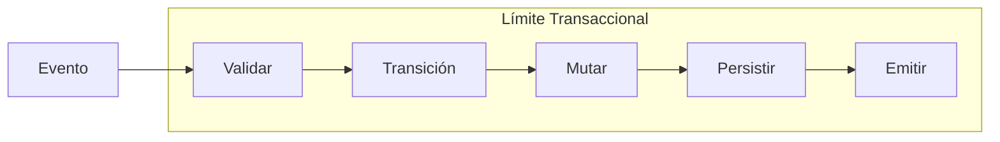

# Vista General del Protocolo (v0.1)

El protocolo RIGOR define las reglas formales para sistemas de backend generados por IA. Transforma la intención arquitectónica en un contrato determinista y verificable.

## 1. El Problema Estructural

La **entropía estructural** surge en los sistemas generados por IA cuando la velocidad de implementación supera la supervisión estructural humana. Se manifiesta cuando:

* **El estado se muta** fuera de las transiciones explícitas.
* **El contexto crece** sin restricciones tipadas.
* **Los eventos no se declaran contractualmente.**
* **La ejecución carece** de límites transaccionales deterministas.
* **La evolución de versiones** no está gobernada formalmente.

Esto produce un comportamiento divergente, un desvío indetectable y rutas de ejecución no reproducibles. RIGOR existe para eliminar formalmente estas condiciones asegurando que el cambio estructural nunca supere a la gobernanza estructural.

---

## 2. La Respuesta del Protocolo RIGOR

El protocolo introduce una gobernanza determinista a través de cinco invariantes fundamentales:

### 2.1 Validación Previa a la Ejecución
Cada especificación de proceso debe superar verificaciones estructurales, de esquema y de compatibilidad de versiones. Ningún proceso puede ejecutarse a menos que sea válido. Esto evita el comportamiento indefinido en tiempo de ejecución.

### 2.2 Esquema de Contexto Tipado
Cada proceso declara un `context_schema` estático. Todos los campos deben ser declarados y todas las mutaciones deben ajustarse a los tipos declarados. No se permite la creación implícita de campos.

### 2.3 Modelo Explícito de Evento → Transición
Las transiciones deben declararse como un mapeo explícito: `(estado, evento) → estado_objetivo`. No se permiten transiciones implícitas y cada par debe ser único.

### 2.4 Mutación Solo Dentro de las Transiciones
La mutación del contexto puede ocurrir exclusivamente dentro de las transiciones declaradas activadas por eventos. Se prohíben las mutaciones en segundo plano, por efectos secundarios o las modificaciones arbitrarias del estado.

### 2.5 Procesamiento de Eventos Transaccional
Cada evento se procesa como una única transacción atómica. La transición de estado, la mutación del contexto y la emisión de eventos tienen éxito o se revierten juntos, lo que garantiza una consistencia fuerte por evento.

---

## 3. Antes vs Después de RIGOR

| Propiedad | Sin RIGOR | Con RIGOR |
| :--- | :--- | :--- |
| **Estado** | Implícito | Explícito |
| **Contexto** | No tipado | Tipado |
| **Transiciones** | Ocultas | Declaradas |
| **Mutación** | Arbitraria | Controlada |
| **Validación** | Solo en ejecución | Estática + Ejecución |
| **Evolución** | Ad hoc | Versionada |
| **Determinismo** | Débil | Fuerte |

---

## 4. Diagrama del Ciclo de Ejecución

El siguiente diagrama ilustra el ciclo de ejecución atómico de un solo evento en un sistema compatible con RIGOR:

---

## 5. Protocolo vs Implementación

RIGOR mantiene una separación formal entre el estándar y su interpretación en tiempo de ejecución:

* **El Protocolo define**: Invariantes semánticos, contratos estructurales y garantías de comportamiento.
* **El Motor implementa**: Análisis, validación, ejecución de transacciones y estrategia de persistencia.

El protocolo sigue siendo válido independientemente de cualquier motor o lenguaje de programación específico.

---

## 6. Gobernanza de Evolución Determinista

Cada especificación de proceso incluye un `rigor_spec_version` y un `spec_version`. La evolución está versionada explícitamente y se valida durante la migración para evitar el desvío de comportamiento silencioso.

## 7. Resumen de Garantías Estructurales

Un sistema compatible con RIGOR garantiza formalmente:
1. **Sin mutación implícita.**
2. **Sin crecimiento de contexto no tipado.**
3. **Sin eventos no declarados.**
4. **Sin procesamiento de eventos no atómico.**
5. **Sin evolución estructural silenciosa.**

Esta es la eliminación formal de la entropía estructural.
