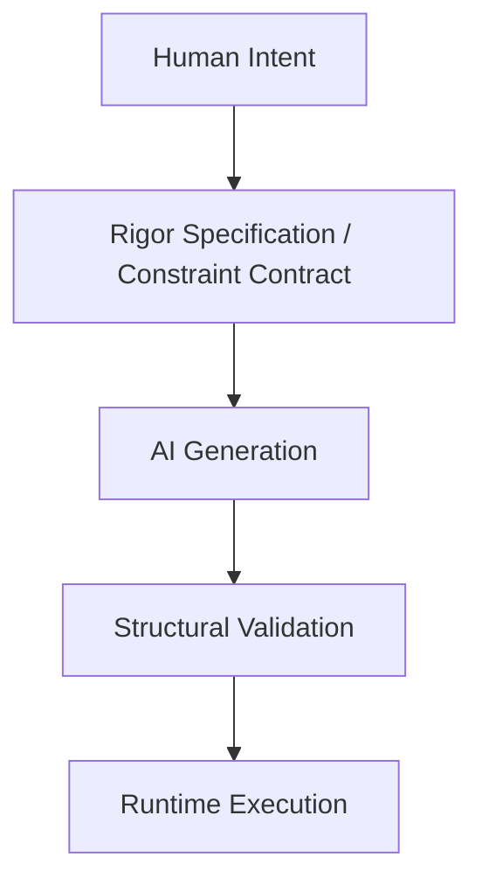

# Protocol Model (v0.1)

## 1. Purpose

The RIGOR AI Constraint Protocol Model defines the formal conceptual framework that governs the structural boundaries of AI-generated systems. It formalizes:
- The structural position of the protocol.
- Its normative components.
- The interaction boundaries between human intent, AI generation, and runtime execution.

## 2. Architectural Position

In modern AI-assisted development, RIGOR introduces a **Constraint Layer** that operates between human intention and runtime execution:

The protocol does not generate implementation or execute processes; it defines and enforces structural boundaries through **validation before execution**.

## 3. Core Normative Components

The RIGOR protocol is composed of five mandatory components:

### 3.1 Intent Domain
Defines the formally allowed structural space. It includes valid states, permitted events, explicit transitions, and version boundaries. Anything outside this domain is structurally invalid.

### 3.2 Constraint Contract
A machine-verifiable specification instance (the Spec). It describes state definitions, transition mappings, version classification rules, and migration constraints. Once validated for a given version, the contract is immutable.

### 3.3 Generation Boundary
Defines the interface between AI output and structural validation. AI generation is permitted only within declared boundaries. No implicit transitions or undeclared structural elements are allowed.

### 3.4 Validation Engine (Conceptual Role)
The engine evaluates structural compliance and confirms deterministic transitions. It does not execute business logic; its sole purpose is to enforce structural legality. Execution without prior validation violates the protocol.

### 3.5 Evolution Layer
Defines how structural changes are classified. Every change must be explicitly categorized as **Compatible**, **Conditional**, or **Breaking**. Silent structural evolution is prohibited.

## 4. Protocol Invariants

The following properties are non-negotiable for any RIGOR-compliant system:

- **Deterministic Transition**: Given a State + Event + Version, the result must be a single valid transition or a typed structural violation. No ambiguity is permitted.
- **Explicitness**: All transitions must be declared. Implicit behavior violates the protocol.
- **Validation Precedence**: Validation must always precede execution. If validation fails, execution must not occur.
- **Evolution Classification**: All structural changes must be version-typed. Unclassified evolution invalidates compatibility guarantees.

## 5. Structural Validation Flow

The protocol requires a two-step validation lifecycle:

1. **Pre-generation Validation**: Verification of the Specification (Constraint Contract) itself.
2. **Post-generation Structural Validation**: Verification that the generated code/implementation adheres strictly to the validated specification.

Failure at either stage invalidates the process.

## 6. Structural Boundedness

RIGOR introduces the property of **Structural Boundedness**: a system cannot evolve beyond its declared structural domain without an explicit version rupture. This ensures traceable evolution, predictable migration, and deterministic compatibility.

## 7. Separation of Concerns

The protocol enforces formal separation between four distinct layers:
1. **Language Definition** (The RIGOR DSL).
2. **Specification Instance** (The specific Constraint Contract).
3. **Validation Mechanism** (The Engine's validation logic).
4. **Execution Runtime** (The actual system implementation).

No layer may implicitly assume the structural behavior of another; all coupling must be explicit and declared.
