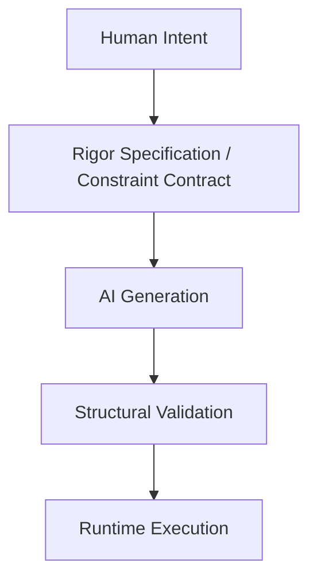

# Protocol Model (v0.1)

## 1. Purpose

The RIGOR AI Constraint Protocol Model defines the formal conceptual framework that governs the structural boundaries of AI-generated systems. It formalizes:
- The structural position of the protocol.
- Its normative components.
- The interaction boundaries between human intent, AI generation, and runtime execution.

## 2. Architectural Position

In modern AI-assisted development, RIGOR introduces a **Constraint Layer** that operates between human intention and runtime execution:

The protocol does not generate implementation or execute processes; it defines and enforces structural boundaries through **validation before execution**.

## 3. Core Normative Components

The RIGOR protocol is composed of five mandatory components:

### 3.1 Intent Domain
Defines the formally allowed structural space. It includes valid states, permitted events, explicit transitions, and version boundaries. Anything outside this domain is structurally invalid.

### 3.2 Constraint Contract
A machine-verifiable specification instance (the Spec). It describes state definitions, transition mappings, version classification rules, and migration constraints. Once validated for a given version, the contract is immutable.

### 3.3 Generation Boundary
Defines the interface between AI output and structural validation. AI generation is permitted only within declared boundaries. No implicit transitions or undeclared structural elements are allowed.

### 3.4 Validation Engine (Conceptual Role)
The engine evaluates structural compliance and confirms deterministic transitions. It does not execute business logic; its sole purpose is to enforce structural legality. Execution without prior validation violates the protocol.

### 3.5 Evolution Layer
Defines how structural changes are classified. Every change must be explicitly categorized as **Compatible**, **Conditional**, or **Breaking**. Silent structural evolution is prohibited.

### 3.6 Context Schema and Type System
Every RIGOR process MUST declare a typed `context_schema`. The context represents the persistent state data owned by the process instance.

**Requirements:**
* All fields must be explicitly declared with a static type.
* No implicit properties are allowed.
* Context mutations must conform to the declared types.
* Unknown fields are rejected at validation time.

Without a declared context schema, a process is invalid. This enables static validation, deterministic mutation legality, and cross-engine compatibility.

## 4. Event-Driven Mutation Model

RIGOR enforces an event-driven mutation architecture. State and context may only change inside explicitly declared transitions triggered by events.

A valid transition must:
1. Declare the triggering event.
2. Declare the target state.
3. Explicitly declare which context fields mutate.

Mutations outside transitions are prohibited by protocol. This constraint guarantees structural traceability, predictable state evolution, and the elimination of hidden side effects.

## 5. Extended Protocol Invariants

The following properties are non-negotiable for any RIGOR-compliant system:

1. **Explicit Typing Invariant**: All context data must be declared in the schema. No dynamic properties allowed.
2. **Mutation Locality Invariant**: Context mutation may occur only inside declared transitions triggered by events.
3. **Event Atomicity Invariant**: Each event is processed as an independent transactional unit (All-or-Nothing).
4. **Deterministic Transition**: Given a State + Event, the resulting transition is uniquely defined.
5. **Deterministic Replay Invariant**: Given the same initial state and ordered event sequence, the outcome must be identical.
6. **Validation Precedence**: Structural validation must always precede execution.
7. **No Implicit Side-Effects Invariant**: The protocol does not permit hidden or undeclared state mutation.
8. **Terminal Stability Invariant**: Terminal states cannot emit further transitions.

## 6. Transactional Event Semantics

Each processed event constitutes a single atomic transactional unit. Event handling must execute the following steps:
1. Validate that the event is applicable in the current state.
2. Evaluate optional guards (which must be pure).
3. Apply declared context mutations.
4. Transition to the new state.
5. Persist the new state and context atomically.

If any step fails, no mutation is persisted and the process remains in its previous state. This guarantees strong consistency at the process level.

## 7. Internal Event Emission and Queueing

RIGOR allows internal event emission. However:
* Emitted events MUST be enqueued.
* They MUST NOT be processed within the same transactional boundary.
* They MUST be processed as independent subsequent events.

This preserves atomic event semantics and deterministic replay behavior.

## 8. Structural Validation Flow

The protocol requires a two-step validation lifecycle:

1. **Pre-generation Validation**: Verification of the Specification (Constraint Contract) itself.
2. **Post-generation Structural Validation**: Verification that the generated code/implementation adheres strictly to the validated specification.

Failure at either stage invalidates the process.

## 9. Structural Boundedness

RIGOR introduces the property of **Structural Boundedness**: a system cannot evolve beyond its declared structural domain without an explicit version rupture. This ensures traceable evolution, predictable migration, and deterministic compatibility.

## 10. Consistency Model

RIGOR guarantees **strong consistency** at the process level. It does not require global distributed transactions. Instead, consistency is achieved via atomic per-event processing, deterministic transition logic, and explicit event contracts. External systems must integrate via event boundaries.

## 11. Core Stability and Evolution

RIGOR Core v0.1 is considered semantically frozen. Changes must be explicitly classified as:
* **Compatible** (additive)
* **Conditionally Compatible**
* **Breaking** (requires major version increment)

This policy protects ecosystem stability and ensures that breaking changes are intentional and manageable.

## 12. Separation of Concerns

The protocol enforces formal separation between four distinct layers:
1. **Language Definition** (The RIGOR DSL).
2. **Specification Instance** (The specific Constraint Contract).
3. **Validation Mechanism** (The Engine's validation logic).
4. **Execution Runtime** (The actual system implementation).

No layer may implicitly assume the structural behavior of another; all coupling must be explicit and declared.
