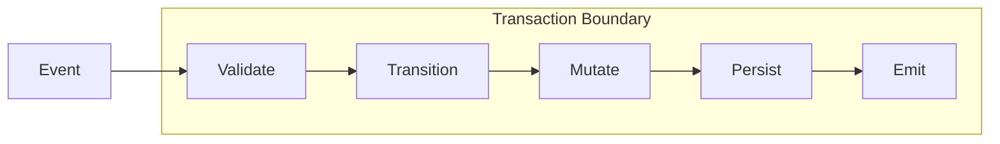

# Protocol Overview (v0.1)

The RIGOR protocol defines the formal rules for AI-generated backend systems. It transforms architectural intent into a deterministic and verifiable contract.

## 1. The Structural Problem

**Structural entropy** emerges in AI-generated systems when implementation velocity exceeds human structural oversight. It manifests when:

* **State is mutated** outside explicit transitions.
* **Context grows** without typed constraints.
* **Events are not contractually declared.**
* **Execution lacks** deterministic transactional boundaries.
* **Version evolution** is not formally governed.

This produces divergent behavior, undetectable drift, and non-reproducible execution paths. RIGOR exists to formally eliminate these conditions by ensuring that structural change never outpaces structural governance.

---

## 2. RIGOR's Protocol Response

The protocol introduces deterministic governance through five foundational invariants:

### 2.1 Validation Before Execution
Every process specification must pass structural, schema, and version compatibility checks. No process may execute unless valid. This prevents undefined runtime behavior.

### 2.2 Typed Context Schema
Every process declares a static `context_schema`. All fields must be declared, and all mutations must conform to declared types. No implicit field creation is permitted.

### 2.3 Explicit Event → Transition Model
Transitions must be declared as explicit mapping: `(state, event) → target_state`. No implicit transitions are allowed, and each pair must be unique.

### 2.4 Mutation Only Within Transitions
Context mutation may occur exclusively inside declared transitions triggered by events. Background, side-effect, or arbitrary state modifications are prohibited.

### 2.5 Transactional Event Processing
Each event is processed as a single atomic transaction. The state transition, context mutation, and event emission all succeed or rollback together, ensuring strong consistency per event.

---

## 3. Before vs After RIGOR

| Property | Without RIGOR | With RIGOR |
| :--- | :--- | :--- |
| **State** | Implicit | Explicit |
| **Context** | Untyped | Typed |
| **Transitions** | Hidden | Declared |
| **Mutation** | Arbitrary | Controlled |
| **Validation** | Runtime only | Static + Runtime |
| **Evolution** | Ad hoc | Versioned |
| **Determinism** | Weak | Strong |

---

## 4. Execution Cycle Diagram

The following diagram illustrates the atomic execution cycle of a single event in a RIGOR-compliant system:

---

## 5. Protocol vs Implementation

RIGOR maintains a formal separation between the standard and its runtime interpretation:

* **The Protocol defines**: Semantic invariants, structural contracts, and behavioral guarantees.
* **The Engine implements**: Parsing, validation, transaction execution, and persistence strategy.

The protocol remains valid independently of any specific engine or programming language.

---

## 6. Deterministic Evolution Governance

Each process specification includes a `rigor_spec_version` and a `spec_version`. Evolution is explicitly versioned and validated during migration to prevent silent behavioral drift.

## 7. Structural Guarantees Summary

A RIGOR-compliant system formally guarantees:
1. **No implicit mutation.**
2. **No untyped context growth.**
3. **No undeclared events.**
4. **No non-atomic event processing.**
5. **No silent structural evolution.**

This is the formal elimination of structural entropy.
