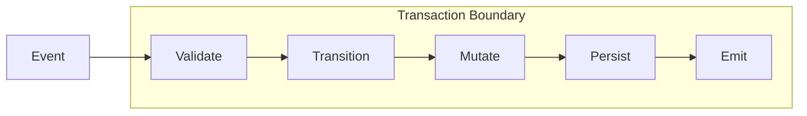
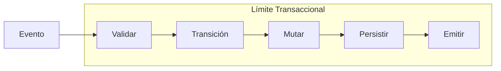

# BUILDER INSTRUCTIONS: Protocol Overview Update (v1)

**Status:** Ready for Implementation  
**Context:** Full rewrite and structural expansion of the Protocol Overview to align with RIGOR Core v0.1 frozen semantics.  
**Reference:** `project_brief/06 - CHANGES/DOCS-PAGE/DOCS_CHANGES_PROTOCOL-OVERVIEW.md`

---

## 🎯 Objectives
1.  Completely rewrite `protocol-overview.md` (EN and ES) with a formal, technical architectural focus.
2.  Connect structural entropy to formal Core invariants.
3.  Implement the "Before vs After RIGOR" comparison tables.
4.  Add a transactional execution diagram using Mermaid.
5.  Maintain multilingual synchronization and technical precision.

---

## 🛠️ Step 1: Update `apps/docs/specification/protocol-overview.md`

Replace the entire content with the following:

```markdown
# Protocol Overview (v0.1)

The RIGOR protocol defines the formal rules for AI-generated backend systems. It transforms architectural intent into a deterministic and verifiable contract.

## 1. The Structural Problem

**Structural entropy** emerges in AI-generated systems when implementation velocity exceeds human structural oversight. It manifests when:

* **State is mutated** outside explicit transitions.
* **Context grows** without typed constraints.
* **Events are not contractually declared.**
* **Execution lacks** deterministic transactional boundaries.
* **Version evolution** is not formally governed.

This produces divergent behavior, undetectable drift, and non-reproducible execution paths. RIGOR exists to formally eliminate these conditions by ensuring that structural change never outpaces structural governance.

---

## 2. RIGOR’s Protocol Response

The protocol introduces deterministic governance through five foundational invariants:

### 2.1 Validation Before Execution
Every process specification must pass structural, schema, and version compatibility checks. No process may execute unless valid. This prevents undefined runtime behavior.

### 2.2 Typed Context Schema
Every process declares a static `context_schema`. All fields must be declared, and all mutations must conform to declared types. No implicit field creation is permitted.

### 2.3 Explicit Event → Transition Model
Transitions must be declared as explicit mapping: `(state, event) → target_state`. No implicit transitions are allowed, and each pair must be unique.

### 2.4 Mutation Only Within Transitions
Context mutation may occur exclusively inside declared transitions triggered by events. Background, side-effect, or arbitrary state modifications are prohibited.

### 2.5 Transactional Event Processing
Each event is processed as a single atomic transaction. The state transition, context mutation, and event emission all succeed or rollback together, ensuring strong consistency per event.

---

## 3. Before vs After RIGOR

| Property | Without RIGOR | With RIGOR |
| :--- | :--- | :--- |
| **State** | Implicit | Explicit |
| **Context** | Untyped | Typed |
| **Transitions** | Hidden | Declared |
| **Mutation** | Arbitrary | Controlled |
| **Validation** | Runtime only | Static + Runtime |
| **Evolution** | Ad hoc | Versioned |
| **Determinism** | Weak | Strong |

---

## 4. Execution Cycle Diagram

The following diagram illustrates the atomic execution cycle of a single event in a RIGOR-compliant system:



---

## 5. Protocol vs Implementation

RIGOR maintains a formal separation between the standard and its runtime interpretation:

* **The Protocol defines**: Semantic invariants, structural contracts, and behavioral guarantees.
* **The Engine implements**: Parsing, validation, transaction execution, and persistence strategy.

The protocol remains valid independently of any specific engine or programming language.

---

## 6. Deterministic Evolution Governance

Each process specification includes a `rigor_spec_version` and a `spec_version`. Evolution is explicitly versioned and validated during migration to prevent silent behavioral drift.

## 7. Structural Guarantees Summary

A RIGOR-compliant system formally guarantees:
1. **No implicit mutation.**
2. **No untyped context growth.**
3. **No undeclared events.**
4. **No non-atomic event processing.**
5. **No silent structural evolution.**

This is the formal elimination of structural entropy.
```

---

## 🧱 Step 2: Update `apps/docs/es/specification/protocol-overview.md`

Replace the entire content with the following:

```markdown
# Vista General del Protocolo (v0.1)

El protocolo RIGOR define las reglas formales para sistemas de backend generados por IA. Transforma la intención arquitectónica en un contrato determinista y verificable.

## 1. El Problema Estructural

La **entropía estructural** surge en los sistemas generados por IA cuando la velocidad de implementación supera la supervisión estructural humana. Se manifiesta cuando:

* **El estado se muta** fuera de las transiciones explícitas.
* **El contexto crece** sin restricciones tipadas.
* **Los eventos no se declaran contractualmente.**
* **La ejecución carece** de límites transaccionales deterministas.
* **La evolución de versiones** no está gobernada formalmente.

Esto produce un comportamiento divergente, un desvío indetectable y rutas de ejecución no reproducibles. RIGOR existe para eliminar formalmente estas condiciones asegurando que el cambio estructural nunca supere a la gobernanza estructural.

---

## 2. La Respuesta del Protocolo RIGOR

El protocolo introduce una gobernanza determinista a través de cinco invariantes fundamentales:

### 2.1 Validación Previa a la Ejecución
Cada especificación de proceso debe superar verificaciones estructurales, de esquema y de compatibilidad de versiones. Ningún proceso puede ejecutarse a menos que sea válido. Esto evita el comportamiento indefinido en tiempo de ejecución.

### 2.2 Esquema de Contexto Tipado
Cada proceso declara un `context_schema` estático. Todos los campos deben ser declarados y todas las mutaciones deben ajustarse a los tipos declarados. No se permite la creación implícita de campos.

### 2.3 Modelo Explícito de Evento → Transición
Las transiciones deben declararse como un mapeo explícito: `(estado, evento) → estado_objetivo`. No se permiten transiciones implícitas y cada par debe ser único.

### 2.4 Mutación Solo Dentro de las Transiciones
La mutación del contexto puede ocurrir exclusivamente dentro de las transiciones declaradas activadas por eventos. Se prohíben las mutaciones en segundo plano, por efectos secundarios o las modificaciones arbitrarias del estado.

### 2.5 Procesamiento de Eventos Transaccional
Cada evento se procesa como una única transacción atómica. La transición de estado, la mutación del contexto y la emisión de eventos tienen éxito o se revierten juntos, lo que garantiza una consistencia fuerte por evento.

---

## 3. Antes vs Después de RIGOR

| Propiedad | Sin RIGOR | Con RIGOR |
| :--- | :--- | :--- |
| **Estado** | Implícito | Explícito |
| **Contexto** | No tipado | Tipado |
| **Transiciones** | Ocultas | Declaradas |
| **Mutación** | Arbitraria | Controlada |
| **Validación** | Solo en ejecución | Estática + Ejecución |
| **Evolución** | Ad hoc | Versionada |
| **Determinismo** | Débil | Fuerte |

---

## 4. Diagrama del Ciclo de Ejecución

El siguiente diagrama ilustra el ciclo de ejecución atómico de un solo evento en un sistema compatible con RIGOR:



---

## 5. Protocolo vs Implementación

RIGOR mantiene una separación formal entre el estándar y su interpretación en tiempo de ejecución:

* **El Protocolo define**: Invariantes semánticos, contratos estructurales y garantías de comportamiento.
* **El Motor implementa**: Análisis, validación, ejecución de transacciones y estrategia de persistencia.

El protocolo sigue siendo válido independientemente de cualquier motor o lenguaje de programación específico.

---

## 6. Gobernanza de Evolución Determinista

Cada especificación de proceso incluye un `rigor_spec_version` y un `spec_version`. La evolución está versionada explícitamente y se valida durante la migración para evitar el desvío de comportamiento silencioso.

## 7. Resumen de Garantías Estructurales

Un sistema compatible con RIGOR garantiza formalmente:
1. **Sin mutación implícita.**
2. **Sin crecimiento de contexto no tipado.**
3. **Sin eventos no declarados.**
4. **Sin procesamiento de eventos no atómico.**
5. **Sin evolución estructural silenciosa.**

Esta es la eliminación formal de la entropía estructural.
```

---

## ✅ Verification Checklist
- [ ] Build succeeds: `npm run build:docs`.
- [ ] Check both English and Spanish "Protocol Overview" pages.
- [ ] Ensure the Mermaid diagram renders correctly.
- [ ] Verify that all 7 sections are present and follow the logical flow.
